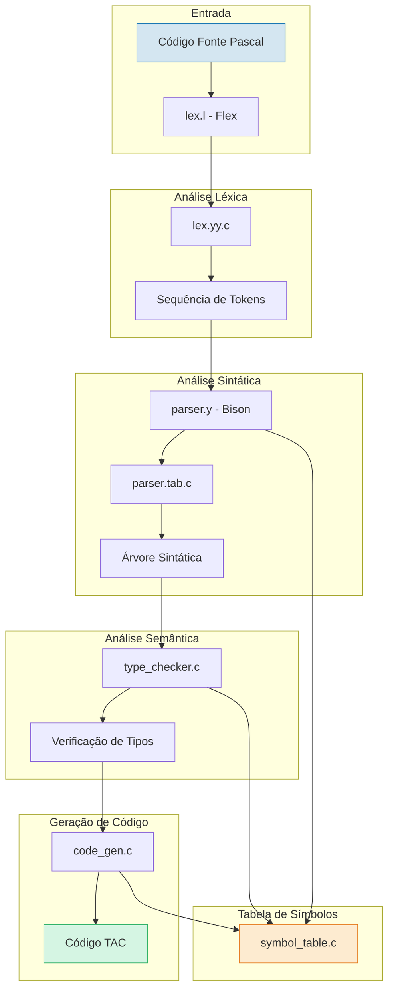
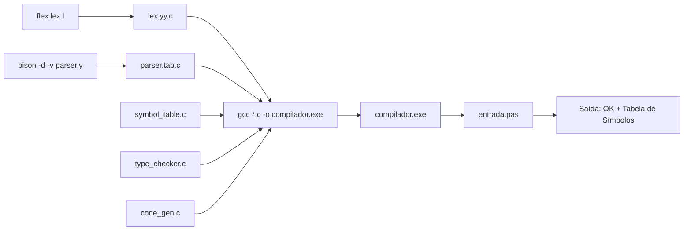

# Compiladores

[](LICENSE)

## 🌐🇧🇷 [Versão em Português do README](README.md)
## 🌐🇺🇸 [English Version of README](README_EN.md)

Repositório da disciplina **Compiladores**, ministrada pelo Professor **Waldemar Pires Ferreira Neto**. Contém projetos, exercícios e materiais relacionados à construção de compiladores, incluindo análise léxica, análise sintática, análise semântica e geração de código.

---

## 📋 Índice

- [Compiladores](#compiladores)
  - [🌐🇧🇷 Versão em Português do README](#-versão-em-português-do-readme)
  - [🌐🇺🇸 English Version of README](#-english-version-of-readme)
  - [📋 Índice](#-índice)
  - [🔨 Funcionalidades do Projeto](#-funcionalidades-do-projeto)
    - [📸 Exemplo Visual do Projeto](#-exemplo-visual-do-projeto)
  - [✔️ Técnicas e Tecnologias Utilizadas](#️-técnicas-e-tecnologias-utilizadas)
  - [📊 Diagrama de Arquitetura](#-diagrama-de-arquitetura)
    - [Fluxo de Compilação](#fluxo-de-compilação)
  - [📁 Estrutura do Projeto](#-estrutura-do-projeto)
  - [🛠️ Pré-requisitos](#️-pré-requisitos)
    - [Instalação no Windows (MSYS2)](#instalação-no-windows-msys2)
    - [Instalação no Linux (Ubuntu/Debian)](#instalação-no-linux-ubuntudebian)
  - [🚀 Como Compilar e Executar](#-como-compilar-e-executar)
    - [Compilação Manual (qualquer subprojeto)](#compilação-manual-qualquer-subprojeto)
    - [Usando Makefile](#usando-makefile)
  - [📦 Subprojetos](#-subprojetos)
    - [1. Calculadora Flex + Bison](#1-calculadora-flex--bison)
    - [2. Analisador Léxico Standalone (Beta)](#2-analisador-léxico-standalone-beta)
    - [3. Compilador Pascal — Projeto 1 (Análise Léxica + Sintática)](#3-compilador-pascal--projeto-1-análise-léxica--sintática)
    - [4. Compilador Pascal — Projeto 2 (Análise Semântica)](#4-compilador-pascal--projeto-2-análise-semântica)

---

## 🔨 Funcionalidades do Projeto

- **Calculadora aritmética** com Flex + Bison, incluindo operador personalizado de módulo (`felipe`)
- **Analisador léxico standalone** que classifica tokens de uma linguagem simplificada
- **Compilador Pascal** completo com:
  - Análise léxica (reconhecimento de tokens, palavras-chave, operadores, comentários)
  - Análise sintática (gramática LALR(1) com Bison)
  - Tabela de símbolos com gerenciamento de escopo
  - Verificação de tipos (compatibilidade entre `integer`, `real`, `boolean`)
  - Geração de código intermediário TAC (Three-Address Code)
  - **Análise semântica** com propagação de tipos nas regras da gramática (Projeto 2)

### 📸 Exemplo Visual do Projeto

<div align="center">
  
</div>

---

## ✔️ Técnicas e Tecnologias Utilizadas

| Tecnologia | Função |
|---|---|
| **GNU Flex** | Geração do analisador léxico |
| **GNU Bison** | Geração do parser LALR(1) |
| **Linguagem C** | Implementação dos módulos do compilador |
| **GCC (MinGW)** | Compilação do código gerado |
| **Make** | Automação do processo de build |
| **Three-Address Code (TAC)** | Representação intermediária do código |

---

## 📊 Diagrama de Arquitetura



### Fluxo de Compilação



---

## 📁 Estrutura do Projeto

```
Compilers/
├── aula8-calculadora-flex-bison/        # Calculadora aritmética (exercício em sala)
│   ├── calc.l                           # Analisador léxico (Flex)
│   ├── calc.y                           # Analisador sintático (Bison)
│   └── Makefile                         # Automação de compilação
│
├── projeto1-va-lexical-pascal-beta/     # Analisador léxico standalone
│   ├── lex.l                            # Flex simples (sem Bison)
│   ├── entrada.txt                      # Exemplo de entrada
│   └── README-DOCS.md                   # Documentação de referência
│
├── projeto1-va-lexical-pascal/          # Compilador Pascal — Projeto 1 (VA)
│   ├── lex.l                            # Analisador léxico do Pascal
│   ├── parser.y                         # Gramática Pascal + main()
│   ├── symbol_table.c / .h              # Tabela de símbolos (lista ligada)
│   ├── type_checker.c / .h              # Verificador de tipos
│   ├── code_gen.c / .h                  # Gerador de código TAC
│   ├── entrada.pas                      # Exemplo de programa Pascal
│   └── Makefile                         # Build automatizado
│
├── projeto2-va-lexical-pascal/          # Compilador Pascal — Projeto 2 (VA)
│   ├── lex.l                            # Analisador léxico (aprimorado)
│   ├── parser.y                         # Gramática com propagação de tipos
│   ├── symbol_table.c / .h              # Tabela de símbolos (aprimorada)
│   ├── type_checker.c / .h              # Verificador semântico (6 verificações)
│   ├── code_gen.c / .h                  # Gerador de código TAC
│   ├── entrada.pas                      # Programa Pascal de exemplo
│   ├── teste_erro.pas                   # Teste com erro semântico
│   ├── DESCRICAO.pdf                    # Descrição do projeto
│   └── Makefile                         # Build automatizado
│
├── LICENSE                              # Licença Apache 2.0
├── README.md                            # Este arquivo (Português)
└── README_EN.md                         # Documentação em Inglês
```

---

## 🛠️ Pré-requisitos

Antes de compilar os projetos, certifique-se de ter instalado:

- **GNU Flex** — Gerador de analisador léxico
- **GNU Bison** — Gerador de parser
- **GCC (MinGW)** — Compilador C
- **Make** (opcional) — Automação de build

### Instalação no Windows (MSYS2)

```bash
pacman -S mingw-w64-x86_64-gcc
pacman -S flex
pacman -S bison
pacman -S make
```

### Instalação no Linux (Ubuntu/Debian)

```bash
sudo apt install flex bison gcc make
```

---

## 🚀 Como Compilar e Executar

### Compilação Manual (qualquer subprojeto)

```bash
# 1. Gerar o analisador léxico
flex lex.l

# 2. Gerar o parser (Bison)
bison -d -v parser.y

# 3. Compilar todos os módulos
gcc -c lex.yy.c -o lexer.o
gcc -c parser.tab.c -o parser.o
gcc -c symbol_table.c -o symbol_table.o
gcc -c type_checker.c -o type_checker.o
gcc -c code_gen.c -o code_gen.o

# 4. Linkar e gerar executável
gcc *.o -o compilador.exe

# 5. Executar com um arquivo Pascal
.\compilador.exe entrada.pas
```

### Usando Makefile

```bash
# Compilar tudo
make

# Executar com entrada padrão
make run

# Limpar arquivos gerados
make clean
```

---

## 📦 Subprojetos

### 1. Calculadora Flex + Bison

Calculadora interativa de expressões aritméticas, construída como exercício de sala de aula.

**Operadores suportados:**

| Operador | Exemplo | Resultado |
|---|---|---|
| `+` | `5 + 3` | `8.00` |
| `-` | `10 - 4` | `6.00` |
| `*` | `6 * 7` | `42.00` |
| `/` | `20 / 4` | `5.00` |
| `felipe` | `5 felipe 2` | `1.00` (resto) |

**Personalização:** Token `felipe` implementa o operador de módulo (`fmod`).

```bash
cd aula8-calculadora-flex-bison
make run
```

---

### 2. Analisador Léxico Standalone (Beta)

Analisador léxico simples que lê código-fonte e imprime tokens classificados. Precursor do compilador Pascal completo.

**Exemplo de execução:**
```
Entrada: if (x = 10) while x + 1

Saída:
PALAVRA-CHAVE: if
PARENTESE: (
IDENTIFICADOR: x
OPERADOR: =
NUMERO: 10
PARENTESE: )
PALAVRA-CHAVE: while
IDENTIFICADOR: x
OPERADOR: +
NUMERO: 1
```

```bash
cd projeto1-va-lexical-pascal-beta
flex lex.l
gcc lex.yy.c -lfl -o analisador.exe
.\analisador.exe < entrada.txt
```

---

### 3. Compilador Pascal — Projeto 1 (Análise Léxica + Sintática)

Compilador para um subconjunto da linguagem Pascal com as seguintes etapas:

- ✅ Análise léxica (Flex) — reconhece palavras-chave, identificadores, números, operadores, comentários
- ✅ Análise sintática (Bison) — gramática LALR(1) com 2 conflitos shift/reduce (aceitáveis)
- ✅ Tabela de símbolos — lista ligada com gerenciamento de escopo
- ✅ Verificador de tipos — compatibilidade `integer`/`real`/`boolean`
- ✅ Geração de código TAC — 22 opcodes de código intermediário

**Exemplo de entrada (`entrada.pas`):**
```pascal
program exemplo;
var
  x, y : integer;
  z : real;
begin
  x := 1;
  y := 2;
  z := 3.5;
  if x > y then
    x := y
  else
    y := x;
  while x < y do
    x := x + 1
end.
```

**Saída esperada:**
```
=== Compilador Pascal ===

=== OK ===

=== Tabela de Símbolos ===
  Nome                 Tipo       Categoria
  exemplo              procedure  procedure  linha: 1
  x                    integer    variable   linha: 1
  y                    integer    variable   linha: 1
  z                    real       variable   linha: 1
  teste                procedure  procedure  linha: 1
  a                    integer    variable   linha: 1
Total: 6 símbolos
```

```bash
cd projeto1-va-lexical-pascal
make run
```

---

### 4. Compilador Pascal — Projeto 2 (Análise Semântica)

Evolução do Projeto 1 com análise semântica completa integrada ao parser.

**Verificações semânticas implementadas:**

| # | Verificação | Exemplo de Erro |
|---|---|---|
| 1 | Tipo incompatível na atribuição | `x: integer; y: real; ... x := y` |
| 2 | Condição não-booleana no `if` | `if 1 then ...` |
| 3 | Condição não-booleana no `while` | `while 1 do ...` |
| 4 | Operação aritmética com booleano | `true + 1` |
| 5 | Tipos incompatíveis em comparação | `1 > true` |
| 6 | Variável não declarada | `x := 1` sem `var x` |

**Saída com erro semântico:**
```
=== Compilador Pascal ===

=== Erros de Tipo (1) ===
  Linha 9: Tipos incompatíveis na atribuição
```

```bash
cd projeto2-va-lexical-pascal
make run
```

<div align="center">
  <strong>Compiladores</strong> — Disciplina ministrada pelo Prof. Waldemar Pires Ferreira Neto
</div>
