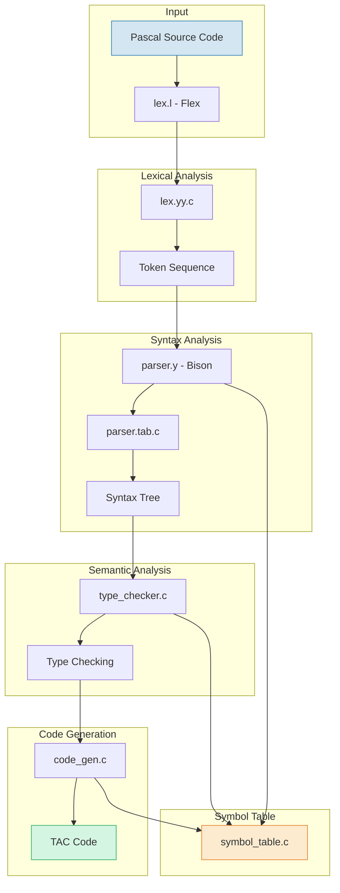
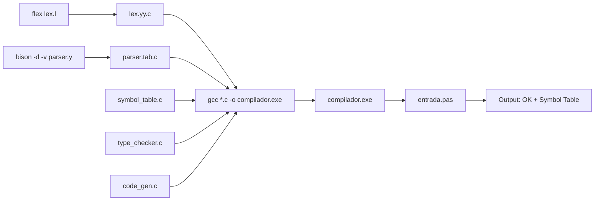

# Compilers

[](LICENSE)

## 🌐🇺🇸 [English Version of README](README_EN.md)
## 🌐🇧🇷 [Versão em Português do README](README.md)

Repository for the **Compilers** discipline taught by Professor **Waldemar Pires Ferreira Neto**. Contains projects, exercises, and materials related to compiler construction, including lexical analysis, syntax analysis, semantic analysis, and code generation.

---

## 📋 Table of Contents

- [Compilers](#compilers)
  - [🌐🇺🇸 English Version of README](#-english-version-of-readme)
  - [🌐🇧🇷 Versão em Português do README](#-versão-em-português-do-readme)
  - [📋 Table of Contents](#-table-of-contents)
  - [🔨 Project Features](#-project-features)
    - [📸 Visual Example](#-visual-example)
  - [✔️ Technologies and Tools](#️-technologies-and-tools)
  - [📊 Architecture Diagram](#-architecture-diagram)
    - [Build Flow](#build-flow)
  - [📁 Project Structure](#-project-structure)
  - [🛠️ Prerequisites](#️-prerequisites)
    - [Windows Installation (MSYS2)](#windows-installation-msys2)
    - [Linux Installation (Ubuntu/Debian)](#linux-installation-ubuntudebian)
  - [🚀 How to Build and Run](#-how-to-build-and-run)
    - [Manual Compilation (any subproject)](#manual-compilation-any-subproject)
    - [Using Makefile](#using-makefile)
  - [📦 Subprojects](#-subprojects)
    - [1. Flex + Bison Calculator](#1-flex--bison-calculator)
    - [2. Standalone Lexical Analyzer (Beta)](#2-standalone-lexical-analyzer-beta)
    - [3. Pascal Compiler — Project 1 (Lexical + Syntax Analysis)](#3-pascal-compiler--project-1-lexical--syntax-analysis)
    - [4. Pascal Compiler — Project 2 (Semantic Analysis)](#4-pascal-compiler--project-2-semantic-analysis)

---

## 🔨 Project Features

- **Arithmetic calculator** with Flex + Bison, including custom modulo operator (`felipe`)
- **Standalone lexical analyzer** that classifies tokens from a simplified language
- **Complete Pascal compiler** with:
  - Lexical analysis (token recognition, keywords, operators, comments)
  - Syntax analysis (LALR(1) grammar with Bison)
  - Symbol table with scope management
  - Type checking (compatibility between `integer`, `real`, `boolean`)
  - TAC (Three-Address Code) intermediate code generation
  - **Semantic analysis** with type propagation through grammar rules (Project 2)

### 📸 Visual Example

<div align="center">
  
</div>

---

## ✔️ Technologies and Tools

| Technology | Purpose |
|---|---|
| **GNU Flex** | Lexical analyzer generation |
| **GNU Bison** | LALR(1) parser generation |
| **C Language** | Compiler module implementation |
| **GCC (MinGW)** | C code compilation |
| **Make** | Build automation |
| **Three-Address Code (TAC)** | Intermediate code representation |

---

## 📊 Architecture Diagram



### Build Flow



---

## 📁 Project Structure

```
Compilers/
├── aula8-calculadora-flex-bison/        # Arithmetic calculator (class exercise)
│   ├── calc.l                           # Lexical analyzer (Flex)
│   ├── calc.y                           # Syntax analyzer (Bison)
│   └── Makefile                         # Build automation
│
├── projeto1-va-lexical-pascal-beta/     # Standalone lexical analyzer
│   ├── lex.l                            # Simple Flex (no Bison)
│   ├── entrada.txt                      # Sample input
│   └── README-DOCS.md                   # Reference documentation
│
├── projeto1-va-lexical-pascal/          # Pascal Compiler — Project 1 (VA)
│   ├── lex.l                            # Pascal lexical analyzer
│   ├── parser.y                         # Pascal grammar + main()
│   ├── symbol_table.c / .h              # Symbol table (linked list)
│   ├── type_checker.c / .h              # Type checker
│   ├── code_gen.c / .h                  # TAC code generator
│   ├── entrada.pas                      # Sample Pascal program
│   └── Makefile                         # Automated build
│
├── projeto2-va-lexical-pascal/          # Pascal Compiler — Project 2 (VA)
│   ├── lex.l                            # Lexical analyzer (enhanced)
│   ├── parser.y                         # Grammar with type propagation
│   ├── symbol_table.c / .h              # Symbol table (enhanced)
│   ├── type_checker.c / .h              # Semantic checker (6 checks)
│   ├── code_gen.c / .h                  # TAC code generator
│   ├── entrada.pas                      # Sample Pascal program
│   ├── teste_erro.pas                   # Test with semantic error
│   ├── DESCRICAO.pdf                    # Project description (PT-BR)
│   └── Makefile                         # Automated build
│
├── LICENSE                              # Apache License 2.0
├── README.md                            # Portuguese documentation
└── README_EN.md                         # This file (English)
```

---

## 🛠️ Prerequisites

Before compiling the projects, make sure you have installed:

- **GNU Flex** — Lexical analyzer generator
- **GNU Bison** — Parser generator
- **GCC (MinGW)** — C compiler
- **Make** (optional) — Build automation

### Windows Installation (MSYS2)

```bash
pacman -S mingw-w64-x86_64-gcc
pacman -S flex
pacman -S bison
pacman -S make
```

### Linux Installation (Ubuntu/Debian)

```bash
sudo apt install flex bison gcc make
```

---

## 🚀 How to Build and Run

### Manual Compilation (any subproject)

```bash
# 1. Generate lexical analyzer
flex lex.l

# 2. Generate parser (Bison)
bison -d -v parser.y

# 3. Compile all modules
gcc -c lex.yy.c -o lexer.o
gcc -c parser.tab.c -o parser.o
gcc -c symbol_table.c -o symbol_table.o
gcc -c type_checker.c -o type_checker.o
gcc -c code_gen.c -o code_gen.o

# 4. Link and generate executable
gcc *.o -o compilador.exe

# 5. Run with a Pascal file
.\compilador.exe entrada.pas
```

### Using Makefile

```bash
# Compile everything
make

# Run with default input
make run

# Clean generated files
make clean
```

---

## 📦 Subprojects

### 1. Flex + Bison Calculator

Interactive arithmetic calculator built as a classroom exercise.

**Supported operators:**

| Operator | Example | Result |
|---|---|---|
| `+` | `5 + 3` | `8.00` |
| `-` | `10 - 4` | `6.00` |
| `*` | `6 * 7` | `42.00` |
| `/` | `20 / 4` | `5.00` |
| `felipe` | `5 felipe 2` | `1.00` (remainder) |

**Customization:** The `felipe` token implements the modulo operator (`fmod`).

```bash
cd aula8-calculadora-flex-bison
make run
```

---

### 2. Standalone Lexical Analyzer (Beta)

Simple lexical analyzer that reads source code and prints classified tokens. Precursor to the full Pascal compiler.

**Execution example:**
```
Input: if (x = 10) while x + 1

Output:
KEYWORD: if
PARENTHESIS: (
IDENTIFIER: x
OPERATOR: =
NUMBER: 10
PARENTHESIS: )
KEYWORD: while
IDENTIFIER: x
OPERATOR: +
NUMBER: 1
```

```bash
cd projeto1-va-lexical-pascal-beta
flex lex.l
gcc lex.yy.c -lfl -o analisador.exe
.\analisador.exe < entrada.txt
```

---

### 3. Pascal Compiler — Project 1 (Lexical + Syntax Analysis)

Compiler for a subset of the Pascal language with the following stages:

- ✅ Lexical analysis (Flex) — recognizes keywords, identifiers, numbers, operators, comments
- ✅ Syntax analysis (Bison) — LALR(1) grammar with 2 shift/reduce conflicts (acceptable)
- ✅ Symbol table — linked list with scope management
- ✅ Type checker — `integer`/`real`/`boolean` compatibility
- ✅ TAC code generation — 22 opcodes of intermediate code

**Sample input (`entrada.pas`):**
```pascal
program exemplo;
var
  x, y : integer;
  z : real;
begin
  x := 1;
  y := 2;
  z := 3.5;
  if x > y then
    x := y
  else
    y := x;
  while x < y do
    x := x + 1
end.
```

**Expected output:**
```
=== Compilador Pascal ===

=== OK ===

=== Tabela de Símbolos ===
  Nome                 Tipo       Categoria
  exemplo              procedure  procedure  linha: 1
  x                    integer    variable   linha: 1
  y                    integer    variable   linha: 1
  z                    real       variable   linha: 1
  teste                procedure  procedure  linha: 1
  a                    integer    variable   linha: 1
Total: 6 símbolos
```

```bash
cd projeto1-va-lexical-pascal
make run
```

---

### 4. Pascal Compiler — Project 2 (Semantic Analysis)

Evolution of Project 1 with full semantic analysis integrated into the parser.

**Implemented semantic checks:**

| # | Check | Error Example |
|---|---|---|
| 1 | Incompatible type in assignment | `x: integer; y: real; ... x := y` |
| 2 | Non-boolean `if` condition | `if 1 then ...` |
| 3 | Non-boolean `while` condition | `while 1 do ...` |
| 4 | Arithmetic with boolean | `true + 1` |
| 5 | Incompatible types in comparison | `1 > true` |
| 6 | Undeclared variable | `x := 1` without `var x` |

**Output with semantic error:**
```
=== Compilador Pascal ===

=== Erros de Tipo (1) ===
  Linha 9: Tipos incompatíveis na atribuição
```

```bash
cd projeto2-va-lexical-pascal
make run
```

<div align="center">
  <strong>Compilers</strong> — Discipline taught by Prof. Waldemar Pires Ferreira Neto
</div>
