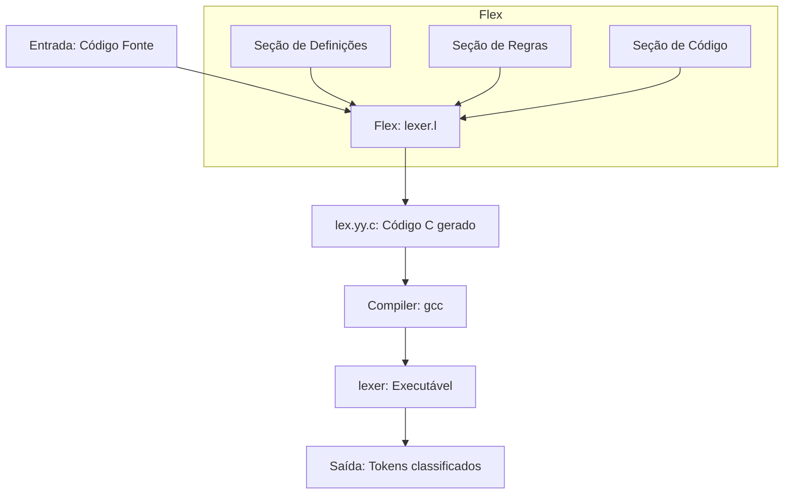

## 🌐🇧🇷 [Versão em Português do README](README.md)
## 🌐🇺🇸 [English Version of README](README_EN.md)

# Analisador Léxico com FLEX

Este projeto implementa um analisador léxico utilizando a ferramenta **GNU Flex** para reconhecimento de tokens de uma linguagem de programação simplificada.

## 🎯 Funcionalidades do Projeto

- **Palavras-chave**: `if`, `else`, `while`
- **Identificadores**: nomes de variáveis (ex: `x`, `contador`, `variavel1`)
- **Números inteiros**: sequência de dígitos (ex: `10`, `42`, `0`)
- **Operadores**: `+`, `-`, `*`, `/`, `=`
- **Parênteses**: `(`, `)`
- **Espaços em branco**: ignorados pelo analisador
- **Erros léxicos**: caracteres não reconhecidos são reportados

### 📋 Exemplo de Execução

**Entrada:**
```
if (x = 10) while x + 1
```

**Saída:**
```
PALAVRA-CHAVE: if
PARENTESE: (
IDENTIFICADOR: x
OPERADOR: =
NUMERO: 10
PARENTESE: )
PALAVRA-CHAVE: while
IDENTIFICADOR: x
OPERADOR: +
NUMERO: 1
```

## 🛠️ Tecnologias Utilizadas

- **GNU Flex** - Gerador de analisadores léxicos
- **GCC** - Compilador C
- **C** - Linguagem de programação

## 📊 Diagrama do Fluxo do Analisador Léxico



## 📁 Estrutura do Projeto

```
lexical-analyzer-with-flex/
├── lex.l              # Arquivo fonte do Flex (analisador léxico)
├── README-DOCS.md     # Documentação de referência
├── README.md          # Este arquivo (Português)
└── README_EN.md       # Documentação em Inglês
```

## 🚀 Como Compilar e Executar

### Pré-requisitos

- **Flex** instalado no sistema
- **GCC** (compilador C) instalado

     Para instalar no Windows:                                                                             • context7 Connected                    
                                                                                                           • figma Needs auth                      
     1. Instalar o GCC (compilador C):                                                                     • filesystem Connected                  
        - Baixe o MinGW-w64 (https://www.mingw-w64.org/) ou use o MSYS2 (https://www.msys2.org/)           • grep_app Connected                    
        - Instale, adicione o caminho ao PATH                                                              • jina Connected                        
                                                                                                           • playwright Connected                  
     2. Instalar o Flex:                                                                                   • rube Needs auth                       
        - No MSYS2: pacman -S flex                                                                         • sentry Needs auth                     
        - Ou baixe o WinFlexBison: https://github.com/lexxmark/winflexbison

### Passos para compilar

1. **Gere o código C a partir do arquivo Flex:**
   ```bash
   flex lex.l
   ```

2. **Compile o código gerado:**
   ```bash
   gcc lex.yy.c -lfl -o lexer
   ```

3. **Execute o analisador:**
   ```bash
   # Com entrada via terminal
   ./lexer
   
   # Ou com arquivo de entrada
   ./lexer < entrada.txt
   ```

### Exemplo de arquivo de entrada (`entrada.txt`)

```
if (x = 10) while x + 1
```

## 🔧 Como o Analisador Funciona

O arquivo `lex.l` contém três seções principais:

1. **Seção de Definições**: Declarações e includes em C
2. **Seção de Regras**: Expressões regulares associadas a ações
3. **Seção de Código**: Função main e rotinas auxiliares

### Regras de Recognição

| Padrão | Descrição | Ação |
|---------|------------|------|
| `[ \t]+` | Espaços em branco | Ignorar |
| `if\|else\|while` | Palavras-chave | Imprimir "PALAVRA-CHAVE" |
| `[a-zA-Z_][a-zA-Z0-9_]*` | Identificadores | Imprimir "IDENTIFICADOR" |
| `[0-9]+` | Números inteiros | Imprimir "NUMERO" |
| `[\+\-\*/=]` | Operadores | Imprimir "OPERADOR" |
| `[()]` | Parênteses | Imprimir "PARENTESE" |
| `.` | Outros caracteres | Imprimir "ERRO LEXICO" |

## 📝 Licença

Este projeto está sob a licença Apache License 2.0 - consulte o arquivo [LICENSE](../LICENSE) para mais detalhes.