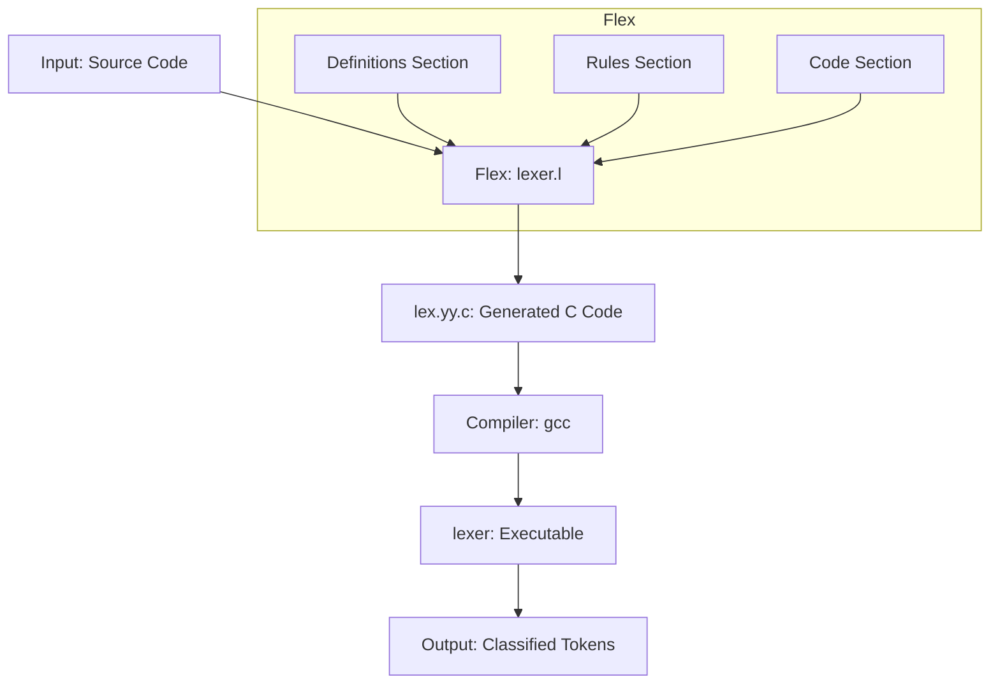

## 🌐🇧🇷 [Versão em Português do README](README.md)
## 🌐🇺🇸 [English Version of README](README_EN.md)

# Lexical Analyzer with FLEX

This project implements a lexical analyzer using **GNU Flex** to recognize tokens from a simplified programming language.

## 🎯 Project Features

- **Keywords**: `if`, `else`, `while`
- **Identifiers**: variable names (e.g., `x`, `counter`, `variable1`)
- **Integer numbers**: digit sequences (e.g., `10`, `42`, `0`)
- **Operators**: `+`, `-`, `*`, `/`, `=`
- **Parentheses**: `(`, `)`
- **Whitespace**: ignored by the analyzer
- **Lexical errors**: unrecognized characters are reported

### 📋 Execution Example

**Input:**
```
if (x = 10) while x + 1
```

**Output:**
```
PALAVRA-CHAVE: if
PARENTESE: (
IDENTIFICADOR: x
OPERADOR: =
NUMERO: 10
PARENTESE: )
PALAVRA-CHAVE: while
IDENTIFICADOR: x
OPERADOR: +
NUMERO: 1
```

## 🛠️ Technologies Used

- **GNU Flex** - Lexical analyzer generator
- **GCC** - C compiler
- **C** - Programming language

## 📊 Lexical Analyzer Flow Diagram



## 📁 Project Structure

```
lexical-analyzer-with-flex/
├── lex.l              # Flex source file (lexical analyzer)
├── README-DOCS.md     # Reference documentation
├── README.md          # This file (Portuguese)
└── README_EN.md       # English documentation
```

## 🚀 How to Compile and Run

### Prerequisites

- **Flex** installed on your system
- **GCC** (C compiler) installed

### Compilation steps

1. **Generate C code from Flex file:**
   ```bash
   flex lex.l
   ```

2. **Compile the generated code:**
   ```bash
   gcc lex.yy.c -lfl -o lexer
   ```

3. **Run the analyzer:**
   ```bash
   # With terminal input
   ./lexer
   
   # Or with input file
   ./lexer < input.txt
   ```

### Example input file (`input.txt`)

```
if (x = 10) while x + 1
```

## 🔧 How the Analyzer Works

The `lex.l` file contains three main sections:

1. **Definitions Section**: C declarations and includes
2. **Rules Section**: Regular expressions with associated actions
3. **Code Section**: Main function and auxiliary routines

### Recognition Rules

| Pattern | Description | Action |
|---------|-------------|--------|
| `[ \t]+` | Whitespace | Ignore |
| `if\|else\|while` | Keywords | Print "PALAVRA-CHAVE" |
| `[a-zA-Z_][a-zA-Z0-9_]*` | Identifiers | Print "IDENTIFICADOR" |
| `[0-9]+` | Integer numbers | Print "NUMERO" |
| `[\+\-\*/=]` | Operators | Print "OPERADOR" |
| `[()]` | Parentheses | Print "PARENTESE" |
| `.` | Other characters | Print "ERRO LEXICO" |

## 📝 License

This project is licensed under the Apache License 2.0 - see the [LICENSE](../LICENSE) file for details.